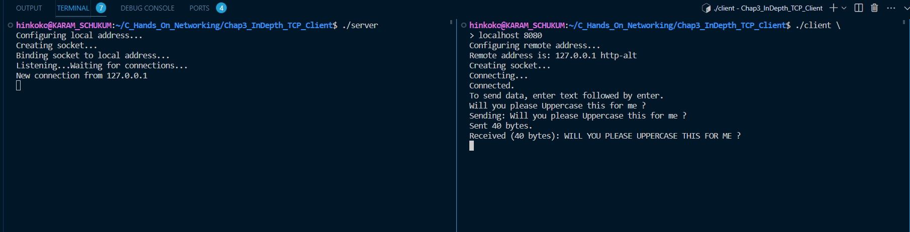
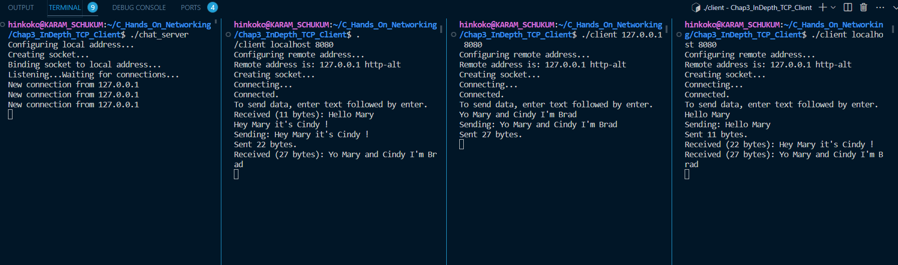

## **Testing TCP Client program**

A pretty cool way to test this program is - of course to compile it before with `gcc` , e.g. running `gcc tcp_client.c -o tcp_client`, and then you can test by connecting to `example.com` on port 80 like so:

```
tcp_client example.com 80
```

Then send the following request

```
GET / HTTP/1.1
Host: example.com
```

You must then send a blank line to indicate the end of your request, You'll receive finally an HTTP response back. Which will certainly look like

```
Configuring remote address...
Remote address is: 93.184.216.34 http
Creating socket...
Connecting...
Connected.
To send data, enter text followed by enter.
GET / HTTP/1.1
Sending: GET / HTTP/1.1
Sent 15 bytes.
Host: example.com
Sending: Host: example.com
Sent 18 bytes.

Sending:
Sent 1 bytes.
Received (1591 bytes): HTTP/1.1 200 OK
Age: 560280
Cache-Control: max-age=604800
Content-Type: text/html; charset=UTF-8
Date: Thu, 30 Nov 2023 16:05:23 GMT
Etag: "3147526947+ident"
Expires: Thu, 07 Dec 2023 16:05:23 GMT
Last-Modified: Thu, 17 Oct 2019 07:18:26 GMT
Server: ECS (nyb/1DCD)
Vary: Accept-Encoding
X-Cache: HIT
Content-Length: 1256

<!doctype html>
<html>
<head>
    <title>Example Domain</title>

    <meta charset="utf-8" />
    <meta http-equiv="Content-type" content="text/html; charset=utf-8" />
    <meta name="viewport" content="width=device-width, initial-scale=1" />
    <style type="text/css">
    body {
        background-color: #f0f0f2;
        margin: 0;
        padding: 0;
        font-family: -apple-system, system-ui, BlinkMacSystemFont, "Segoe UI", "Open Sans", "Helvetica Neue", Helvetica, Arial, sans-serif;
        ......
        ......
        ......
```

## **Testing our "microservice" of UpperCasing -> Server & Client**

First of all of course, we compile our microservice server program with gcc:

```
gcc tcp_microserv_fork.c -o server
```

Then, by opening two terminals, we are able to test the communication between client and server, and to test that our basic microservice works as expected, here's a screenshot of what we get:



## **Testing our chat server**

After compiling our `tcp_chat_room.c` file as usual, we can test it by opening 3 additional terminal in which we run our clients. <br>
In the following screenshot, the leftmost terminal ( the Most Significant Bit terminal 😂) is running our chat_server. <br>
The 3-right terminal are for Mary, Cindy and Brad, able to chit chat as showed, each one gets the messages send by the other and so on.


