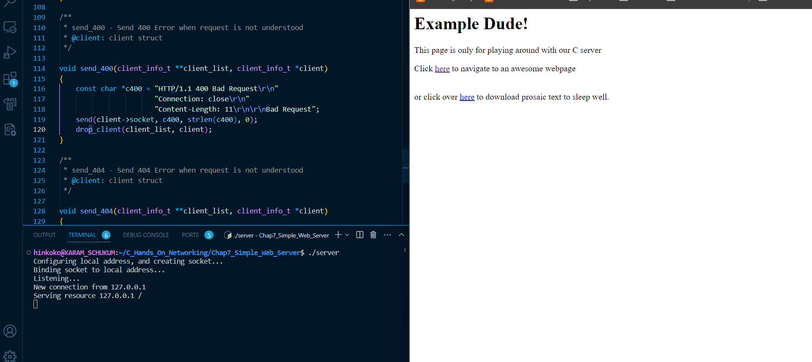
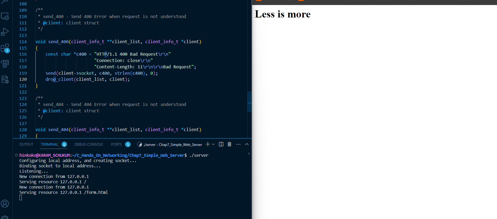

## **Building a simple Web Server in C**

This basic server works by using the **HTTP protocol**, leveraging the strengths of **sockets**, we can connect to it with any standard web browser.<br>
This code runs on **Windows, Linux, MacOS**

C-files of this chapter covers the following:

- **Accepting and buffering multiple connections**
  To achieve this, we defined a C-struct **client_info_t** to store informations for each connected client, and buffers their received data separately.
  For the code to be re-entrant, we pass - in each relevant functions - the root node of the client's linked list, as a separate argument.
  We use a bunch of **helper functions**:

  - **get_client()** search through the linked list given a socket descriptor
  - **drop_client()** closes and drop the client to be removed from the linked list.
  - **get_client_address()** returns a client's IP address as a string (char array).
  - **wait_on_client()** leverage the power of `select()` function to 'wait', until new client connects or if a connected one has some data ready to be send.
  - **send_400() && send_404()** handle HTTP error conditions
  - **serve_resource()** transfer requested file from the client

- **Parsing an HTTP request line**
- **Formatting an HTTP response**
- **Serving a file**
- **Security considerations**

## **Compilation**

As mentionned, this program runs on **Windows, Linux & MacOS** <br>
In order to compile and run it on Windows platform, you have to link your program files with the **Winsock library**. This can be accomplished by passing the `-lws2_32` option to `gcc`

```
# WIndows
gcc *.c -lws2_32 -o basic_server

# *NIX flavored OS
gcc *.c -o basic_server
```

After compilation, run the program and access the resources via any classic web browser. Which gives the following





For sure, if you need "secure and robust" server for exposing to the wild Internet, it's highly recommended to use a free and open source implementation that are already out there. <br>
e.g. web servers such as Nginx and Apache, which are really performant, cross platfom and secure, and cherry on the cake: **written in C**

## **Summary**

We went through implementing an HTTP server in C, not so easy job in C ! <br>
We spent some efforts to ensure multiple clients could be served simultaneously, buffering received data for each client. Each client state is separated via the use of a Linked list.

## **Sources**

Many thanks to the extremely excellent series of book "Hands-On Network Programming with C".
I strongly recommand you to give a try to this series of books.
